## Introduction
The following work analyses the performance of some predictive volatility models built to exploit high frequency data. This is carried out through the development of mainly GARCH-type models but we will sometimes extend the class of models to some other specifications such as CAViaR models. Our object of research is the Oracle Corporation stock. Oracle is an American software company founded in 1977 by Larry Ellison. Starting with a database management product with notable clients among which the CIA, it has now expanded in various branches in the tech industry among which supply chain-, capital-, sales-, human resources-management through its cloud-based software services. The company’s focus on cloud and license business infrastructure technologies put it at the heart of the recent AI-boom in the US. As such, its market capitalization today is evaluated around 420 billion dollars which is comparable to the likes of Palantir, another major American AI company. Oracle stock price is frequently subject to large volatility movements, mostly in relation to major news regarding the company or the US tech sector.

This work is divided in two sections. Firstly, we perform a volatility analysis of the stock returns estimating a wide array of models on the data. The latter is then evaluated through different metrics to observe their sensibility to extreme risks. Secondly, we perform a forecasting exercise in the form of a pseudo-out-of-sample experiment on the last few months of observations. We focus there on a more restricted set of models for the sake of explanatory power and comparability. Again, the models are evaluated by their accuracy, their actual predictive ability and how they behaved in comparison to the realized series. Our period of analysis spans from January 1, 2000 to August 9, 2026. Previous observations were also available but excluded due to extremely noisy returns in 
those early years.
## 1 Volatility Analysis
The Oracle daily stock prices follow the classic story of the tech companies that are still today successful. Historically, the company suffered for its financial mismanagement at the end of the 1990s, aggravated by the Internet Bubble at the start of the century. But Oracle survived and solidified its positions in the tech sector by acquiring key companies such as Hyperion Solutions in 2007, Sun Microsystems (Java, MySQL, LibreOffice…) in 2010 or even Taleo in 2012. From 2021, the steady growth exploded exponentially in relation to bigger acquisitions (ex: Cerner…), exceptional financial results and the implication of the different activities in the AI ecosystem. The all-time high is reached in September 2025 when Oracle announced being part of Project Stargate, which is a 500 billion dollar investment plan in AI infrastructure copiloted with OpenAI and Softbank with the support of the Trump administration. However, concerns and missed expectations surrounding the project subsequently contributed to a sharp decline in the stock price within less 
than a year.
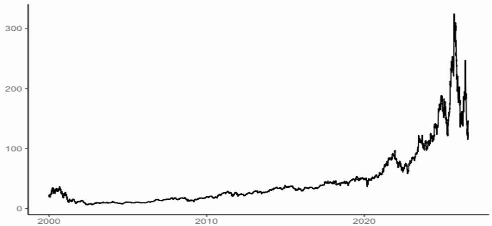

The log-returns displays that very volatile tendency at the start and end of our period of analysis. Nonetheless, we observe the traditional mean-reverting property of the returns (figure 2a) as well assome signs of leverage effect as the squared returns as high-volatility is dominated by the period where Oracle found itself in the most difficult positions (figure 2b).

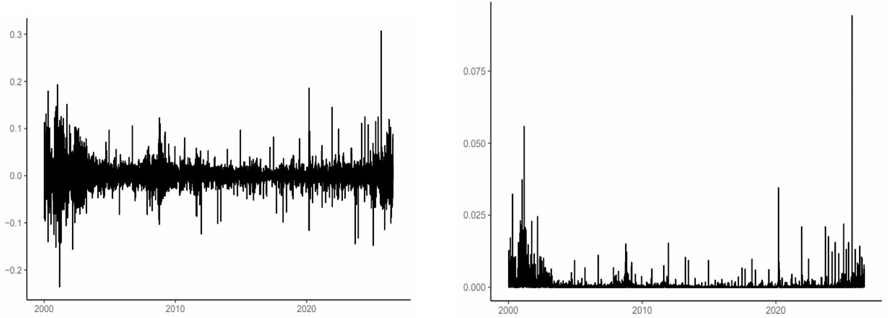

Our observation of stylized facts is not yet finished. Raw returns show no clear pattern of autocorrelation as shown by the ACF (figure 3a) consistently with the idea that they are difficult to predict from their own past values. On the other hand, the ACF of squared returns (figure 3b) displays a strong memory. Not only does this imply the volatility is persistent as the autocorrelation slowly decays but it also clusters as it remains high above our 95 % confidence dotted box.

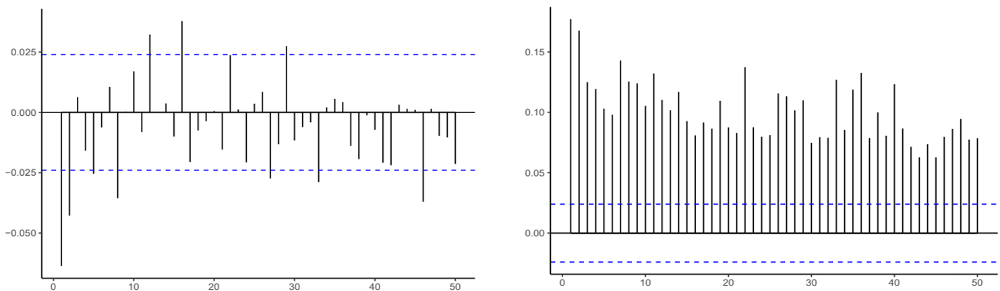

This motivates empirically the estimation by GARCH-type models. Below is a summary table of the results (table 1) :

| |$\mu$ | $\omega$    | $\alpha$ |$\beta$ |$\nu$|$\gamma$|
| -------------- | ---------|------ | -----|--------|---|---|
| GARCH-N        | 0.00051  | ~0  | 0.101 | 0.884 | | |
| GARCH-t        | 0.00078 | ~0   |0.077 | 0.922 | 4.1 | |
| EGARCH         | 0.00012 | -0.1417  |-0.037 | 0.980 | |0.015|
| GJR-GARCH-N    | 0.00034 | ~0  | 0.033 | 0.0912 | |0.08|

Table 1 : Parameter estimates of GARCH models for daily ORCL returns

All of the estimated models highlight a strong volatility persistence in ORCL returns ($\alpha + \beta$ very close to 1 each time) and thus confirms volatility clustering. Our GARCH-t specification allows us to evaluate the shape of the innovation distribution outside of the standard normal distribution. Here, our $\nu$ is relatively low (4.1) which is a significant sign of excess kurtosis and fat tails. Finally the $\gamma$ estimates are both positive and important. GJR-GARCH and EGARCH allow for an asymmetric innovation distribution (skewness) which shows here to underline a leverage effect : negative shocks affect more volatility than positive ones of the same magnitude. Overall, the main volatility dynamics are robust across model specifications, while differences between the models become more apparent during periods of extreme market movements at the start and end of our period of analysis (figure 4).

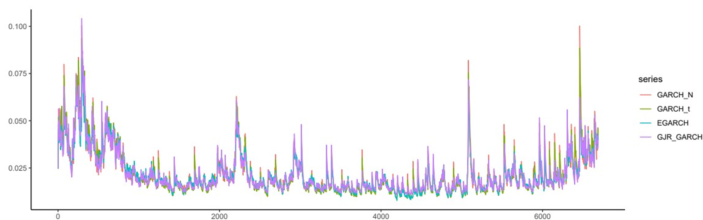

In contrast, the GJR-GARCH model displays somewhat larger responses to several individual shocks, consistent with its ability to capture asymmetric responses in comparison to GARCH-N and-t. 

Next, we must manage the possibility of extreme risks through the computation of the 2.5 % VaR and its Expected Shortfall. We estimate and evaluate again multiple models, using the whole sample
(table 2).

| | $\omega$ | $\alpha$ |$\beta_{1}$ |$\beta_{2}$ |$\beta_{3}$ |$\beta_{4}$ |$\nu$|$\gamma_{1}$|$\gamma_{2}$|$\gamma_{3}$|a|b|
| -------------- | ---|--|----|---|--- | --|---|--|---|---|---|---|
| GARCH-N        | 0.114| 0.102  | 0.883 | | | | | | | | | |
| GJR-GARCH-t    | 0.039 | 0.039  |0.921 | | | | | | | | | |
| CARE-AS        | | |-0.171 | -0.287 |-0.290 |0.854| |1.098 |0.132|0.857| | | 
| SAV-CARE       | | | -0.165 | -0.267 |0.863 | | |1.176|0.112|-0.527| | |
| GAS-1F         | | | 0.989 |  | | | |0.006 | | | -4.140|-5.701 |
| HistSim (250d) |(No Parameters) |

Table 2 : Parameter estimates of different models to model VaR and ES

The estimated parameters generally exhibit the expected signs and admissible ranges. The GARCH and GJR-GARCH estimates imply positive volatility responses and high persistence, while the positive GJR-GARCH asymmetry parameter indicates a leverage effect. These results remain consistent with the previous estimation. The CARE and GAS specifications also produce persistent VaR/ES dynamics with negative tail-risk levels. For CARE-AS the positive value of $\beta_{4}$ indicates substantial persistence in the VaR process and the negative values for $\beta_{2}$ mean larger returns push the VaR in the negative tail for CARE-AS and SAV-CARE. For the GAS-1F, the very high $\beta$ makes it so that it remembers its previous risk/volatility state for a long time. Thus, the estimated VaR and ES don't change abruptly from one day to the next unless there is sufficiently strong new information in the returns. 

Plotting against the realized returns help us gain substantial insights about how each model behaves against extreme risks (figure 5a and 5b). Historical Simulation is a non-parametric method that relies only on past observations (here 250-days rolling window). It underestimates consistently VaR (and subsequently ES) at any large negative spikes and takes a long time to recover. Aside from thisspecial case, all models react pretty similarly in calmer times. They also react accordingly against more hefty movements but it is on the scale of the reactions where divergence shows to be the strongest. CAViaR-type models (AS-CAViaR and SAV-CAViaR) tend to respond dynamically to recent observations as they directly model our two targets. This adaptation scheme helps them improving over time as although they were underestimating risks at the start of the period, they anticipated correctly the numerous spikes from 2020 onward. Also, they remain very accurate in calmer times in both ES and VaR. Surprisingly, on VaR estimates, the GAS1F specification takes a longer time (as anticipated) to recover from negative shocks. It is as unfortunate as the ES computations were very consistent. GARCH-N displays relevant performance though underestimates regularly most of the risks on the more hefty periods of analysis. GJR-GARCH-t tends to give relatively conservative estimates during extreme market conditions. This is especially visible in the ES plot, where it occasionally produces substantially more negative ES forecasts. Hence, it would be the more appropriate model to follow in volatile times in reason of its exaggerated cautiousness. In calmer times, one of the CAViaR specifications is suitable enough. 

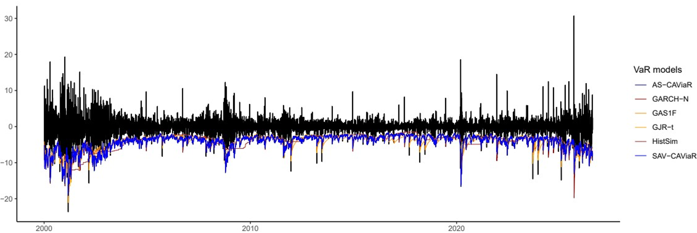
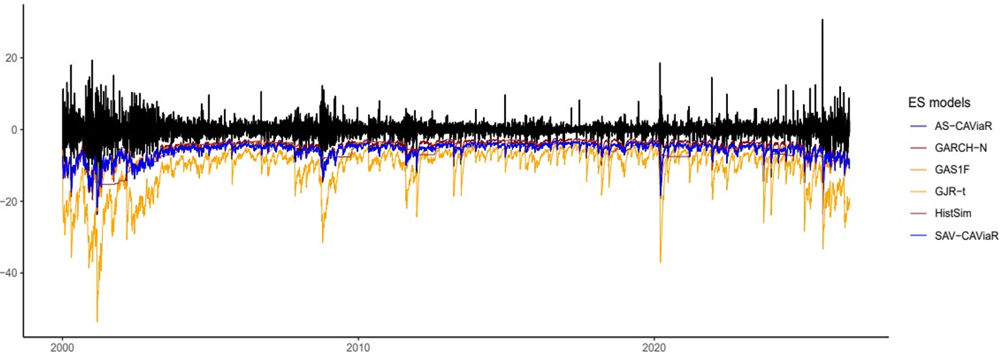

It is to be noted though that visual appreciation is not sufficient to deliver a proper evaluation of which model perfoms actually better. One way to address this situation is to compute how many times our VaR forecast was violated (e.g. the Hit ratio). For a good model, it should only happen as much as the level we defined our VaR on. Hence, we retrieved the computations of the Hit ratios for each model (table 3).

|GARCH-N|GJR-GARCH-t |HistSim | SAV-CAViaR |AS-CAViaR|GAS1F|
| -------------- | ---------|------ | -----|--------|---|
| .02572  | .02647  | .02901  | .02422 | .02437 |.02422 | 

Table 3 : Hit ratio for VaR 2.5%

The closest the ratio is to the defined model (here 2.5%), the better it is. SAV-CAViaR and GAS-1F arrive first ex-aequo closely followed by AS-CAViaR. Unsurprisingly, the over-pessimistic GJR-GARCH-t arrives second-to-last and HistSim dead last.

## 2 Forecasting exercise
The following part handles a one-step-ahead forecasting exercise of the conditional volatility of ORCL.

The first four models that we estimated are all valid candidate models for this task because they are specifically designed to model time-varying volatility and volatility clustering, which are important characteristics of financial returns. As we’ve previously tested their behaviour on our stock, we will focus our efforts on those specifically. One thing to note is that EGARCH is a bit more difficult because of its non-linear structure (EGARCH models the logarithm of the conditional variance to circumvent the sign restrictions of the parameters). It can make the optimization procedure more tedious and the interpretation of the parameters less direct. Thus, before diving in the results, let’s observe how we obtain one-step forecast for the GARCH-N, GARCH-t and GJR-GARCH-t (we exclude EGARCH). The standard equation for a GARCH(1,1) is :

$$
\begin{aligned}
\sigma^{2}_{t} =\omega+\alpha\epsilon^{2}_{t-1}+\beta\sigma^{2}_{t-1}
\end{aligned}
$$

Only the innovation distribution changes between GARCH-N and GARCH-t so the one-step-ahead equation is the same and equal to :

$$
\begin{aligned}
\sigma^{2}_{t+1|t}=\omega+\alpha\epsilon^{2}_{t}+\beta\sigma^{2}_{t|t-1}
\end{aligned}
$$

The GJR-GARCH model introduces an additional term to capture the asymmetric effect of negative shocks:

$$
\begin{aligned}
\sigma^{2}_{t} =\omega+\alpha\epsilon^{2}_{t-1}+\gamma I_{t-1}\epsilon^{2}_{t-1}+\beta\sigma^{2}_{t-1}
\quad where\quad I_{t-1} = \mathrm{|}_{0\quad if\quad \epsilon_{t-1}\ge 0 }^{1\quad if\quad \epsilon_{t-1}<0}
\end{aligned}
$$

The forecast follows : $\sigma^{2}_{t+1|t}=\omega+\alpha\epsilon^{2}_{t}+\lambda\epsilon^{2}_{t}\mathbb{I}\left(\epsilon_{t}\lt 0  \right)+\beta\sigma^{2}_{t|t-1}$

In all cases, the information set is $Z_{t}={r_{t},r_{t-1},...,r_{1}}$ so the forecast is derived from $E[\sigma^{2}_{t+1}|Z_{t}]$.

Now, we are generating a sequence of forecasts for our three models on the last 200 observations (e.g. from 20/10/2025 to 07/08/2026). We use the realized squared returns as a proxy of (realized) volatility and apply two different estimation windows. Firstly, a fixed-scheme where the model is estimated only once on the in-sample period, then a forecast is produced recursively keeping the parameters fixed. Secondly, we exploit a traditional expanding window where the model is fitted anew as each new forecast joins the estimation sample. The two methods output very similar results (figure 6a and 6b). The period is extremely volatile for the ORCL stock and it is not that surprising that the models all fail to predict the numerous spikes throughout this period, whatever the estimation scheme being used.

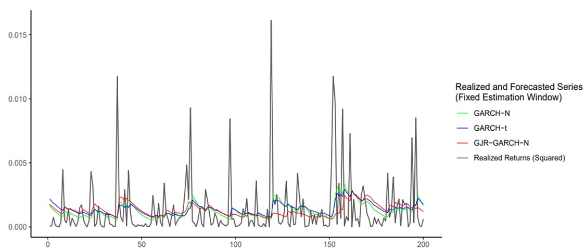
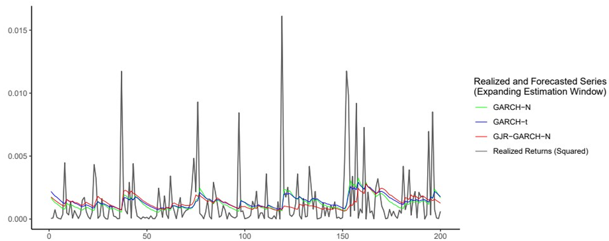

It remains reassuring that the volatility-clustering mechanism of our GARCH-type models still functioned properly. Hence, the ten highest volatility forecasts are concentrated in a short period spanning from June 3rd to the 16th. It corresponds to the release on June 10th of Oracle's FY2026 Q4 earnings. The company reported strong headline numbers — revenue +21%, cloud revenue +47%, and the RPO (the value of contracts not yet recognized as revenue) jumping to $\$$638 billion making it the biggest backlog among the tech hyperscalers. However, the report also reveals free cash flow was down $\$$23.7 billion and that the 2027 strategy would pursue this deepening. Those numbers raised enormous doubts on the capacity of Oracle on converting its RPO into actual revenue and not additional debt for infrastructure. That the period starts on the 3rd indicates there was high anticipation around the release. As a result, Oracle lost almost 20% of market capitalization (figure 7) during the first two weeks of June and has since yet to recover. During this month, the highest forecast was given by the GARCH-N model in both estimation schemes (although still far from reality). But it is to keep in mind that not all highly volatile periods made GARCH-N react the strongest each time, comparing several more pseudo-out-of-sample experiments would be required to assess whether it is actually the most reasonable model choice in hefty times.

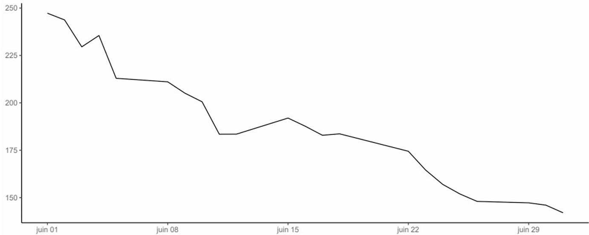

Although the plot already suggests the performance to be mediocre, we can still try to figure out  objectively which model should be followed at best. For this objective, we compute two loss functions : a standard MSE and a QLIKE. The QLIKE is a specifically-designed loss function for volatility forecasts that penalizes asymmetrically over- and under-estimation (by putting more weight on the latter than MSE). The version we use here follows Patton’s (2011) specification$^{2}$ up to additive and multiplicative constants :

$$
\begin{aligned}
QLIKE=\frac{1}{T}\sum_{t}^{}\frac{\hat{\sigma}^{2}_{t}}{h_{t}}-log\left( \frac{\hat{\sigma}^{2}_{t}}{h_{t}} \right)-1
\end{aligned}
$$

> [!NOTE]
> $^{2}$ This particular specification can be found in the Appendix. It doesn’t modify whatsoever the value or ranking interpretation compared to the other one written in the same paper.

where $h_{t}$ is the forecast and $\sigma$ the realization. The results are as follows (table 4a and 4b) :

| |GARCH-N|GARCH-t | GJR-GARCH-N |
| -------------- | ---------|------ | -----|
| Fixed-Window  | .56519  | .56530  | .57614 | 
| Expanding-Window  | **.56478**  | .56520  | .57572 |

Table 4a : MSE Loss for the forecasted squared volatility (scaled by 10$^{5}$)

| |GARCH-N|GARCH-t | GJR-GARCH-N |
| -------------- | ---------|------ | -----|
| Fixed-Window  | 1.48062  | 1.42763  | 1.47882 | 
| Expanding-Window  | 1.47604  | **1.42689**  | 1.47785 |

Table 4b : QLIKE Loss for the forecasted squared volatility

As expected, all models performs similarly great. Even though the expanding estimation window scheme dominates the performance in both metrics, the improvement is barely significant. Considering simultaneously both loss functions, there is no unanimous clear « winner ». Based on MSE, GARCH-N results in the lowest metric in both estimation scheme whereas it is GARCH-t that takes up on this role when computing QLIKE. Thus, our results are at least positive on showing a clear MSE vs. QLIKE trade-off. Nonetheless, one might question whether the slightly better performance observed in some models and/or scheme is the consequence of better predictive capacity or simply a coincidence of the chosen sample. For that purpose, we run a pair-wise Diebold-Mariano test to all of our combinations. The DM test evaluates whether two forecasting methods have equal predictive accuracy, e.g. the null hypothesis is : $H_{0}:E[d_{t}]=0$ with $d_{t}$ the loss differential. We report the p-values in the following tables (table 5a-d) :

| |GARCH-N|GARCH-t | GJR-GARCH-N |
| -------------- | ---------|------ | -----|
| GARCH-N  |  | 0.000006  | 0.68354 | 
| GARCH-t  |  |  | 0.00662 |
| GJR-GARCH-N  |   |  |  |

Table 5a : DM tests for equal predictive ability with MSE (fixed-window) – p-values

| |GARCH-N|GARCH-t | GJR-GARCH-N |
| -------------- | ---------|------ | -----|
| GARCH-N  |  | 0.0000003  | 0.66586 | 
| GARCH-t  |  |  | 0.00399 |
| GJR-GARCH-N  |   |  |  |

Table 5b : DM tests for equal predictive ability with MSE (expanding-window) – p-values

| |GARCH-N|GARCH-t | GJR-GARCH-N |
| -------------- | ---------|------ | -----|
| GARCH-N  |  | ~0 | 0.53305 | 
| GARCH-t  |  |  | 0.00095 |
| GJR-GARCH-N  |   |  |  |

Table 5c : DM tests for equal predictive ability with QLIKE (fixed-window) – p-values

| |GARCH-N|GARCH-t | GJR-GARCH-N |
| -------------- | ---------|------ | -----|
| GARCH-N  |  | ~0 |0.60432 | 
| GARCH-t  |  |  | 0.00065 |
| GJR-GARCH-N  |   |  |  |

Table 5d : DM tests for equal predictive ability with QLIKE (expanding-window) – p-values

The pairwise DM tests indicate consistent results across both the fixed-window and expanding window forecasting schemes. Using both QLIKE and MSE loss functions, the null hypothesis is rejected when comparing GARCH-t with GARCH-N and GJR-GARCH-N (all p-values largely inferior than 1%). In contrast, the null hypothesis cannot be rejected when comparing GARCH-N with GJR-GARCH-N. Thus, there is strong evidence that the GARCH-t model has significantly different predictive accuracy from the other two models, while there is no statistically significant difference between GARCH-N and GJR-GARCH-N. Thus, this comforts our choice of choosing GARCH-t as the outperfomring model for minimizing QLIKE but does the opposite for the MSE, especially considering that GARCH-N scored the best- and GJR-GARCH-N the worst metrics.

One last exercise we will address is multi-step forecasting. Forecasting h-step ahead is a much tougher exercise to get consistent and relevant results on in comparison to one-step ahead. In our case, although past volatility can contain information on how the next period will be, we also know that (especially) volatility reacts strongly to news. Thus, forecasting several steps ahead means our information set will quickly lose relevance. This is accentuated by the fact that traditionnal GARCH-type models are observation-driven and rely heavily on backward-looking components. Up until now, we’ve used an iterative approach to produce one-step ahead outcomes. With h steps, the principle remains similar : the forecasting model is estimated at a frequency higher than the forecast horizon and iterated upon to obtain multistep forecasts. For a GARCH-N(1,1) model, we can derive it recursively from the equations :

$$
\begin{aligned}
\sigma^{2}_{t+h|t}=\mathbb{E}\left[\sigma^{2}_{t+h|t+h-1}|\mathcal{F}_{t}\right]=\sigma^{2}+(\alpha+\beta)^{h-1}(\sigma^{2}_{t+1|t}-\sigma^{2})\\
where\quad \mathbb{E}\left[\sigma^{2}_{t+1|t}\right]=\omega+(\alpha+\beta)\mathbb{E}\left[\sigma^{2}_{t|t-1}\right]=\frac{\omega}{1-\alpha-\beta}=\sigma^{2}
\end{aligned}
$$

Here, we will only focus on the GARCH-N model. We produces 21-step ahead forecasts, corresponding roughly to a month in advance. We repeat the same pseudo-out-of-sample exercise and plot the results, removing the first 21 observations (figure 8a and 8b).

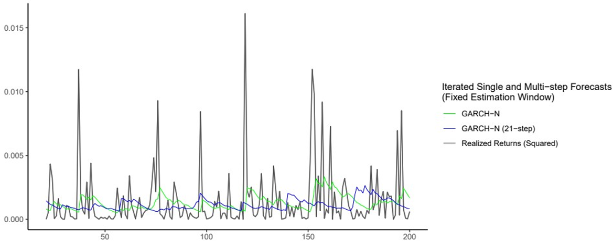
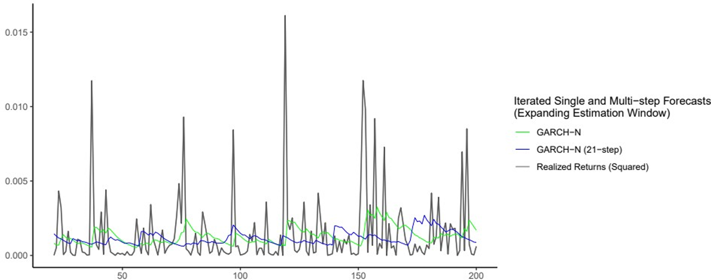

Again, our two new forecatst outputs very similar results between the two estimation schemes and it remains far from the realized series. Now, comparing the single and multi-step forecasts, the one step forecast is more reactive to news (e.g. recent spikes), while the 21-step forecast is smoother as it gazes way forward in the future. But this is not always the case and the multi-step react more strongly to spikes than the one-step. It is a direct consequence of the delay of what’s being included in the information set : our model observes large spikes at a certain period but this information is only included later in the memory and is being retained through memory and persistence. In consequence, it may look as if the 21-step ahead forecasts can react to certain spikes that the one step doesn’t, but it is actually just coincidental seasonality of large shocks. We evaluate those further after computing the loss metrics (table 6a and 6b) : 

| | $GARCH-N\\GARCH-N\\(21-step-ahead)$ | $GARCH-N\\(One-step-ahead-realigned)$ |
| -------------- | ---------|------ | 
| Fixed-Window  | .60870  | .61268  |  
| Expanding-Window  | **.60729**  | .61222  |

Table 6A : MSE Loss for the 21- versus One-step ahead volatility forecast (scaled by 10$^{5}$)

| | $GARCH-N\\(21-step-ahead)$ | $GARCH-N\\(One-step-ahead-realigned)$ |
| -------------- | ---------|------ | 
| Fixed-Window  | 1.46058  | 1.51955  |  
| Expanding-Window  | **1.45249**  | 1.51432  |

Table 6b : QLIKE Loss for the 21- versus One-step ahead volatility forecast

The results displayed above are quite surprising. Despite all arguments mentioned earlier, the long horizon iterated forecasts dominate in both loss functions. Several reasons could explain this occurrence. Objectively, the biggest difference between our two forecasting methods is the information set. Better volatility forecasts using a smaller and further away in the past set could actually give more information about future volatility than recent news on average. But to confirm such claims properly, we would have to repeat the experiment on different periods several times. This brings us to our second argument, which is simply that the former claim reveals itself to be true only as an exceptional event on our particular sample and doesn’t generalize well. Finally, it is to be reminded that we computed our loss functions against the realized squared returns which is a very noisy signal. As the multi-step-ahead procedure outputs a smoother forecast that tends to the long-term variance (like the expected level of the realized squared return), it could be that the loss metrics are hence better as they remain, in the end, penalized averages. This constitutes my final argument. However, I would still rather choose the one-day-ahead forecast. Looking at the plots show how much better it reacts to extreme risks in terms of timing and magnitude. As before, we inspect more deeply the predictive ability of the models with a Diebold-Mariano test (Table 7).

| | MSE |QLIKE |
| -------------- | ---------|------ | 
| Fixed-Window  | .00197  | .00386  |  
| Expanding-Window  |.0045  | .00685  |

Table 7 : DM tests p-values for equal predictive ability (21- versus One-step-ahead forecast)

The DM test p-values lead to a rejection of the null hypothesis in all four cases. This indicates the multi-step-ahead procedure significantly outperforms the one-step-ahead forecast. Although the results seem counterintuitive, my previous statements about said-outputs still constitute plausible explanations.
## Conclusion
This work investigated the modeling and forecasting of financial volatility using daily returns of Oracle Corporation. The analysis combined several families of models, including GARCH-type specifications for conditional volatility, as well as CAViaR and GAS models for tail-risk estimation. The objective was to identify models that provide a good description of the observed volatility dynamics and assess their ability to forecast future volatility.

The first part of the analysis confirmed several well-known stylized facts of financial returns. While the raw returns displayed little significant autocorrelation, their squared returns exhibited strong persistence and volatility clustering. This provided empirical support for the use of conditional volatility models. The estimated GARCH-type models consistently indicated a high degree of volatility persistence, while the additional specifications provided evidence of leverage effect and fat tails. The analysis of VaR and Expected Shortfall illustrated how the different specifications reacted differently to large negative returns whether because of timing or magnitude. The Hit ratio analysis suggested that the CAViaR and GAS specifications provided substantial VaR coverage, while the GJR-GARCH-t model produced more conservative estimates.

The forecasting exercise dealt only with three GARCH specifications. They produced altogether relatively similar forecasts over the pseudo-out-of-sample period, their ranking depending slightly on the loss function used. The Diebold-Mariano tests showed that these differences were statistically meaningful when comparing GARCH-t with the other specifications, while no significant difference was found between GARCH-N and GJR-GARCH-N.

Finally, the comparison between one-step-ahead and 21-step-ahead GARCH forecasts produced an unexpected result as the 21-step-ahead forecast achieved lower losses. The Diebold-Mariano tests confirmed that these differences were statistically significant. This result should nevertheless be interpreted cautiously. The experiment was conducted over a relatively short and particularly volatile period, and squared returns are themselves a very noisy proxy for conditional variance.

## References
Patton, A. (2011). *Volatility Forecast Comparison Using Imperfect Volatility Proxies*. Journal of Econometrics, 
160:246–256.

> [!NOTE]
> Create your slides in Markdown - click the _Slides_ button to check out the example.

Add the publication's **full text** or **supplementary notes** here. You can use rich formatting such as including [code, math, and images](https://docs.hugoblox.com/content/writing-markdown-latex/).
